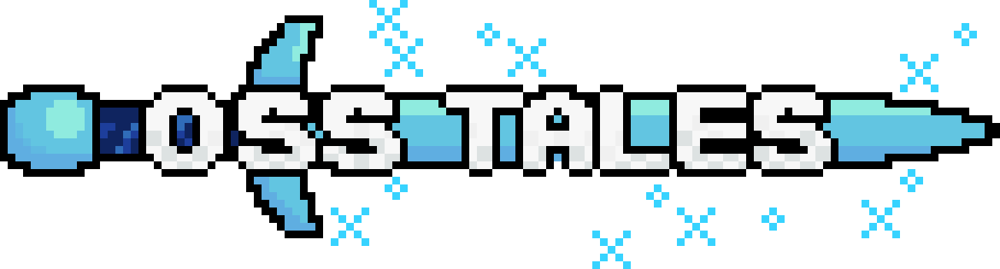

<div align=center>



<h1>Open Source Block Tales</h1>

A faithful moddable recreation of Spaceman Moonbase's Roblox turn-based
pyschological horror RPG, <a href="https://www.roblox.com/games/16483433878/">
Block Tales</a>.

</div>

## Goals

- Be as close to Block Tales as possible: artwork, GUIs, animations, sound
  effects, et cetera.
- Have an organized codebase that can be easily extended for modding
- NOT be a complete 1:1 recreation/decompilation of Block Tales, not only do I
  have to decompile and risk a ban (my main savefile already has 24 hours on it)
  but also it isn't as fun

## Building

```sh
pesde run build
```

<sub>
Spaceman Moonbase can request this project to be taken down by DMing the Discord
user <code>znotfireman</code> or Roblox user <code>ImNotFireMan123</code>. Zero
decompilation from Block Tales was used or referenced for this project.
<br/>
This project was made as a learning experience and because I liked Block Tales.
Zero harm is intended against Spaceman Moonbase or Block Tales, but I'll be more
than happy to work on Block Tales :)
<br/>
Source code is licensed under the MIT license with art assets else licensed
under CC BY 4.0.
</sub>
